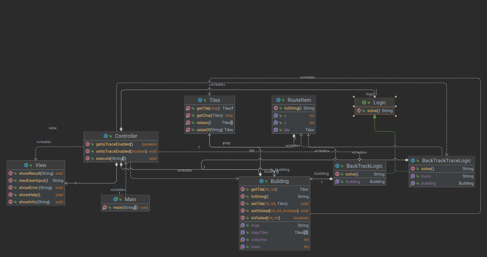
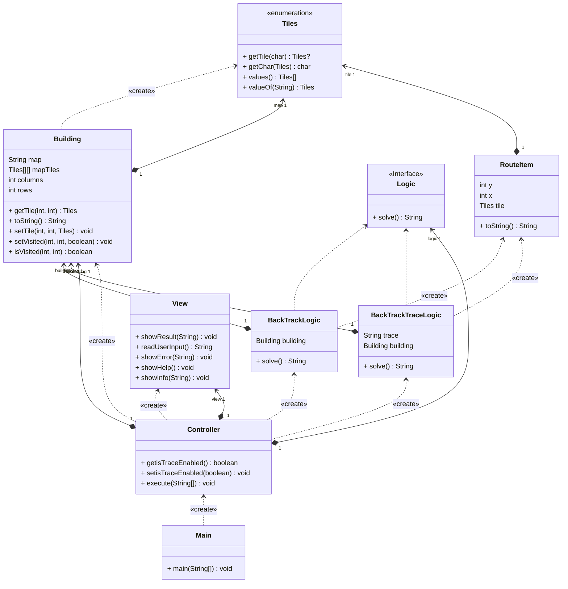

# Memoria Práctica 2 Programación y Estructuras de Datos Avanzadas

## Indice

1. [Introducción](#introducción)


2. [Desarrollo y Código Fuente](#desarrollo-y-código-fuente)
   1. [Modelo](#modelo)
   2. [Vista](#vista)
   3. [Controlador](#controlador)
   4. [Diagrama de clases](#diagrama-de-clases)
   5. [Ejemplos de ejecución](#ejemplos-de-ejecución)


3. [Cuestiones Teóricas](#cuestiones-teóricas)
   1. [1. Indica y razona sobre el coste temporal y espacial del algoritmo.](#1-indica-y-razona-sobre-el-coste-temporal-y-espacial-del-algoritmo)
   2. [2. Explica qué otros esquemas pueden resolver el problema y razona sobre su idoneidad.](#2-explica-qué-otros-esquemas-pueden-resolver-el-problema-y-razona-sobre-su-idoneidad)

   
4. [Conclusiones](#conclusiones)

## Introducción

Esta práctica consiste en una implementación del algoritmo _Vuelta atras_ para resolver la busqueda de un tornillo en un edificio formado por XY número de casillas.

Las casillas pueden ser de 3 tipos:

- Casilla vacía (L)
- Casilla con tornillo (T)
- Casilla de paso estrecho (E)

El algoritmo debe encontrar un camino para llegar al tornillo,sin necesidad de ser el más rápido, si no el primero encontrado.

_Ejemplo de entrada_

```text
5
6
L L E L L E
L E L L L E
L L L E L L
L L E L L L
L L L L T L
```

_Ejemplo de salida_

```text
( 5 , 5 )
( 4 , 5 )
( 3 , 5 )
( 2 , 5 )
( 1 , 5 )
( 1 , 4 )
( 2 , 4 )
( 2 , 3 )
( 3 , 3 )
( 3 , 2 )
( 4 , 2 )
( 5 , 2 )
( 5 , 1 )
( 4 , 1 )
( 3 , 1 )
( 2 , 1 )
( 1 , 1 )
```

La sintaxis de ejecución del programa es la siguiente:

SINTAXIS: robot [-t][-h] [fichero entrada]
-t Traza el algoritmo
-h Muestra esta ayuda
[fichero entrada] Nombre del fichero de entrada
[fichero salida] Nombre del fichero de salida

```bash
java –jar robot.jar [-t][-h] [fichero entrada] [fichero salida]

ó

java robot [-t][-h] [fichero entrada] [fichero salida]
```

## Desarrollo y Código Fuente

He vuelto a utilizar el mismo patrón de diseño que en la Práctica 1, ya que en su momento, decidí dedicarle más tiempo para poder reaprovecharlo.

Volvemos al mismo **M**odelo **V**ista **C**ontrolador, separado en

- **Módelo**: lo necesario para que la lógica funcione, incluido el propio algoritmo.
- **Vista**: Todas las operaciones de entrada y salida, lo necesario para la comunicación con el usuario.
- **Controlador**: Se encarga de gestionar la comunicación entre el modelo y la vista.

### Modelo

El modelo se compone de 3 clases y un Enum:

- **Tiles**: Enumerado que representa los tipos de casilla que puede haber en el edificio.
- **RouteItem**: Representa cada uno de los puntos de la ruta, con sus coordenadas X e Y. Además almacena el tipo de casilla que es. Quería llamarle de otra forma, pero no se me ocurriá y quería mantener el inglés.
- **Building**: Clase que representa el edificio, con sus dimensiones y la matriz de casillas.
- **Logic**: Interfaz que especifica los métodos que debe implementar la clase que se encargue de la lógica del programa, está interfaz se ha creado para poder utilizar diferentes algoritmos de búsqueda y se implementa en dos clases
  - **BackTrackLogic**: Clase que implementa la interfaz Logic y se encarga de la lógica del programa utilizando el algoritmo de vuelta atrás.
  - **BackTrackTraceLogic**: Versión de la clase BackTrackLogic que muestra la traza del algoritmo.

### Vista

La vista se compone de una única clase **View**, que se encarga de la comunicación con el usuario, tanto de entrada como de salida.

Está clase podría haber sido directamente una serie de metodos estáticos, pero he preferido crearla como una clase normal, teniendo así la capacidad de, por ejemplo, añadirle la capacidad de seleccionar una salida (consola, fichero, etc) sin tener que modificar el resto del código.

### Controlador

El controlador se compone de una única clase Controller, que se encarga de gestionar la comunicación entre el modelo y la vista, además de encargarse de la lectura de los argumentos de entrada, y creación del resto de objetos.

### Diagrama de clases





### Ejemplos de ejecución

Todos los ejemplos de ejecución se han realizado en un sistema operativo Linux Ubuntu 23.10 con Java OpenJDK 19.

Se pueden encontrar los archivos de entrada y salida en la carpeta **Pruebas**

#### Ejemplo 1

Entrada:

```text
5
6
L L E L L E
L E L L L E
L L L E L L
L L E L L L
L L L L T L
```

Salida:

```text
/********* EMPIEZA TRAZA *********/
?TRAZA: Buscando en: (1, 1)
?TRAZA: Calculando rutas para: (1, 1)
?TRAZA: Ruta encontrada: (1, 1) -> (2, 1)
?TRAZA: Ruta encontrada: (1, 1) -> (1, 2)
?TRAZA: Buscando en: (2, 1)
?TRAZA: Calculando rutas para: (2, 1)
?TRAZA: Ruta encontrada: (2, 1) -> (3, 1)
?TRAZA: Ruta encontrada: (2, 1) -> (1, 1)
?TRAZA: Buscando en: (3, 1)
?TRAZA: Calculando rutas para: (3, 1)
?TRAZA: Ruta encontrada: (3, 1) -> (4, 1)
?TRAZA: Ruta encontrada: (3, 1) -> (2, 1)
?TRAZA: Ruta encontrada: (3, 1) -> (3, 2)
?TRAZA: Buscando en: (4, 1)
?TRAZA: Calculando rutas para: (4, 1)
?TRAZA: Ruta encontrada: (4, 1) -> (5, 1)
?TRAZA: Ruta encontrada: (4, 1) -> (3, 1)
?TRAZA: Ruta encontrada: (4, 1) -> (4, 2)
?TRAZA: Buscando en: (5, 1)
?TRAZA: Calculando rutas para: (5, 1)
?TRAZA: Ruta encontrada: (5, 1) -> (4, 1)
?TRAZA: Ruta encontrada: (5, 1) -> (5, 2)
?TRAZA: Buscando en: (5, 2)
?TRAZA: Calculando rutas para: (5, 2)
?TRAZA: Ruta encontrada: (5, 2) -> (4, 2)
?TRAZA: Ruta encontrada: (5, 2) -> (5, 3)
?TRAZA: Ruta encontrada: (5, 2) -> (5, 1)
?TRAZA: Buscando en: (4, 2)
?TRAZA: Calculando rutas para: (4, 2)
?TRAZA: Ruta encontrada: (4, 2) -> (5, 2)
?TRAZA: Ruta encontrada: (4, 2) -> (3, 2)
?TRAZA: Ruta encontrada: (4, 2) -> (4, 1)
?TRAZA: Buscando en: (3, 2)
?TRAZA: Calculando rutas para: (3, 2)
?TRAZA: Ruta encontrada: (3, 2) -> (4, 2)
?TRAZA: Ruta encontrada: (3, 2) -> (3, 3)
?TRAZA: Ruta encontrada: (3, 2) -> (3, 1)
?TRAZA: Buscando en: (3, 3)
?TRAZA: Calculando rutas para: (3, 3)
?TRAZA: Ruta encontrada: (3, 3) -> (2, 3)
?TRAZA: Ruta encontrada: (3, 3) -> (3, 2)
?TRAZA: Buscando en: (2, 3)
?TRAZA: Calculando rutas para: (2, 3)
?TRAZA: Ruta encontrada: (2, 3) -> (3, 3)
?TRAZA: Ruta encontrada: (2, 3) -> (2, 4)
?TRAZA: Buscando en: (2, 4)
?TRAZA: Calculando rutas para: (2, 4)
?TRAZA: Ruta encontrada: (2, 4) -> (1, 4)
?TRAZA: Ruta encontrada: (2, 4) -> (2, 5)
?TRAZA: Ruta encontrada: (2, 4) -> (2, 3)
?TRAZA: Buscando en: (1, 4)
?TRAZA: Calculando rutas para: (1, 4)
?TRAZA: Ruta encontrada: (1, 4) -> (2, 4)
?TRAZA: Ruta encontrada: (1, 4) -> (1, 5)
?TRAZA: Buscando en: (1, 5)
?TRAZA: Calculando rutas para: (1, 5)
?TRAZA: Ruta encontrada: (1, 5) -> (2, 5)
?TRAZA: Ruta encontrada: (1, 5) -> (1, 4)
?TRAZA: Buscando en: (2, 5)
?TRAZA: Calculando rutas para: (2, 5)
?TRAZA: Ruta encontrada: (2, 5) -> (3, 5)
?TRAZA: Ruta encontrada: (2, 5) -> (1, 5)
?TRAZA: Ruta encontrada: (2, 5) -> (2, 4)
?TRAZA: Buscando en: (3, 5)
?TRAZA: Calculando rutas para: (3, 5)
?TRAZA: Ruta encontrada: (3, 5) -> (4, 5)
?TRAZA: Ruta encontrada: (3, 5) -> (2, 5)
?TRAZA: Ruta encontrada: (3, 5) -> (3, 6)
?TRAZA: Buscando en: (4, 5)
?TRAZA: Calculando rutas para: (4, 5)
?TRAZA: Ruta encontrada: (4, 5) -> (5, 5)
?TRAZA: Ruta encontrada: (4, 5) -> (3, 5)
?TRAZA: Ruta encontrada: (4, 5) -> (4, 6)
?TRAZA: Ruta encontrada: (4, 5) -> (4, 4)
?TRAZA: Buscando en: (5, 5)
?TRAZA: Encontrado en: (5, 5)
?TRAZA: Añadido a la solución: (4, 5)
?TRAZA: Añadido a la solución: (3, 5)
?TRAZA: Añadido a la solución: (2, 5)
?TRAZA: Añadido a la solución: (1, 5)
?TRAZA: Añadido a la solución: (1, 4)
?TRAZA: Añadido a la solución: (2, 4)
?TRAZA: Añadido a la solución: (2, 3)
?TRAZA: Añadido a la solución: (3, 3)
?TRAZA: Añadido a la solución: (3, 2)
?TRAZA: Añadido a la solución: (4, 2)
?TRAZA: Añadido a la solución: (5, 2)
?TRAZA: Añadido a la solución: (5, 1)
?TRAZA: Añadido a la solución: (4, 1)
?TRAZA: Añadido a la solución: (3, 1)
?TRAZA: Añadido a la solución: (2, 1)
?TRAZA: Añadido a la solución: (1, 1)
/********* TERMINA TRAZA *********/
Tiempo: 7ms
(5, 5)
(4, 5)
(3, 5)
(2, 5)
(1, 5)
(1, 4)
(2, 4)
(2, 3)
(3, 3)
(3, 2)
(4, 2)
(5, 2)
(5, 1)
(4, 1)
(3, 1)
(2, 1)
(1, 1)

```

#### Ejemplo 2

Entrada:

```text
5
6
L L L E E E
E E L L E E
L E E L L E
L L E E L E
L L L E T E
```

Salida:

```text
/********* EMPIEZA TRAZA *********/
?TRAZA: Buscando en: (1, 1)
?TRAZA: Calculando rutas para: (1, 1)
?TRAZA: Ruta encontrada: (1, 1) -> (2, 1)
?TRAZA: Buscando en: (2, 1)
?TRAZA: Calculando rutas para: (2, 1)
?TRAZA: Ruta encontrada: (2, 1) -> (3, 1)
?TRAZA: Buscando en: (3, 1)
?TRAZA: Calculando rutas para: (3, 1)
?TRAZA: Ruta encontrada: (3, 1) -> (2, 1)
?TRAZA: Ruta encontrada: (3, 1) -> (3, 2)
?TRAZA: Buscando en: (3, 2)
?TRAZA: Calculando rutas para: (3, 2)
?TRAZA: Ruta encontrada: (3, 2) -> (4, 2)
?TRAZA: Ruta encontrada: (3, 2) -> (3, 1)
?TRAZA: Buscando en: (4, 2)
?TRAZA: Calculando rutas para: (4, 2)
?TRAZA: Ruta encontrada: (4, 2) -> (3, 2)
?TRAZA: Ruta encontrada: (4, 2) -> (4, 3)
?TRAZA: Buscando en: (4, 3)
?TRAZA: Calculando rutas para: (4, 3)
?TRAZA: Ruta encontrada: (4, 3) -> (5, 3)
?TRAZA: Ruta encontrada: (4, 3) -> (4, 2)
?TRAZA: Buscando en: (5, 3)
?TRAZA: Calculando rutas para: (5, 3)
?TRAZA: Ruta encontrada: (5, 3) -> (4, 3)
?TRAZA: Ruta encontrada: (5, 3) -> (5, 4)
?TRAZA: Buscando en: (5, 4)
?TRAZA: Calculando rutas para: (5, 4)
?TRAZA: Ruta encontrada: (5, 4) -> (5, 5)
?TRAZA: Ruta encontrada: (5, 4) -> (5, 3)
?TRAZA: Buscando en: (5, 5)
?TRAZA: Encontrado en: (5, 5)
?TRAZA: Añadido a la solución: (5, 4)
?TRAZA: Añadido a la solución: (5, 3)
?TRAZA: Añadido a la solución: (4, 3)
?TRAZA: Añadido a la solución: (4, 2)
?TRAZA: Añadido a la solución: (3, 2)
?TRAZA: Añadido a la solución: (3, 1)
?TRAZA: Añadido a la solución: (2, 1)
?TRAZA: Añadido a la solución: (1, 1)
/********* TERMINA TRAZA *********/
Tiempo: 6ms
(5, 5)
(5, 4)
(5, 3)
(4, 3)
(4, 2)
(3, 2)
(3, 1)
(2, 1)
(1, 1)
```

#### Ejemplo 3

Entrada:

```text
5
5
L L L L L
L L L L L
E E E E E
E E E E E
L L T L L
```

Salida:

```text
/********* EMPIEZA TRAZA *********/
?TRAZA: Buscando en: (1, 1)
?TRAZA: Calculando rutas para: (1, 1)
?TRAZA: Ruta encontrada: (1, 1) -> (2, 1)
?TRAZA: Ruta encontrada: (1, 1) -> (1, 2)
?TRAZA: Buscando en: (2, 1)
?TRAZA: Calculando rutas para: (2, 1)
?TRAZA: Ruta encontrada: (2, 1) -> (1, 1)
?TRAZA: Ruta encontrada: (2, 1) -> (2, 2)
?TRAZA: Buscando en: (2, 2)
?TRAZA: Calculando rutas para: (2, 2)
?TRAZA: Ruta encontrada: (2, 2) -> (1, 2)
?TRAZA: Ruta encontrada: (2, 2) -> (2, 3)
?TRAZA: Ruta encontrada: (2, 2) -> (2, 1)
?TRAZA: Buscando en: (1, 2)
?TRAZA: Calculando rutas para: (1, 2)
?TRAZA: Ruta encontrada: (1, 2) -> (2, 2)
?TRAZA: Ruta encontrada: (1, 2) -> (1, 3)
?TRAZA: Ruta encontrada: (1, 2) -> (1, 1)
?TRAZA: Buscando en: (1, 3)
?TRAZA: Calculando rutas para: (1, 3)
?TRAZA: Ruta encontrada: (1, 3) -> (2, 3)
?TRAZA: Ruta encontrada: (1, 3) -> (1, 4)
?TRAZA: Ruta encontrada: (1, 3) -> (1, 2)
?TRAZA: Buscando en: (2, 3)
?TRAZA: Calculando rutas para: (2, 3)
?TRAZA: Ruta encontrada: (2, 3) -> (1, 3)
?TRAZA: Ruta encontrada: (2, 3) -> (2, 4)
?TRAZA: Ruta encontrada: (2, 3) -> (2, 2)
?TRAZA: Buscando en: (2, 4)
?TRAZA: Calculando rutas para: (2, 4)
?TRAZA: Ruta encontrada: (2, 4) -> (1, 4)
?TRAZA: Ruta encontrada: (2, 4) -> (2, 5)
?TRAZA: Ruta encontrada: (2, 4) -> (2, 3)
?TRAZA: Buscando en: (1, 4)
?TRAZA: Calculando rutas para: (1, 4)
?TRAZA: Ruta encontrada: (1, 4) -> (2, 4)
?TRAZA: Ruta encontrada: (1, 4) -> (1, 5)
?TRAZA: Ruta encontrada: (1, 4) -> (1, 3)
?TRAZA: Buscando en: (1, 5)
?TRAZA: Calculando rutas para: (1, 5)
?TRAZA: Ruta encontrada: (1, 5) -> (2, 5)
?TRAZA: Ruta encontrada: (1, 5) -> (1, 4)
?TRAZA: Buscando en: (2, 5)
?TRAZA: Calculando rutas para: (2, 5)
?TRAZA: Ruta encontrada: (2, 5) -> (1, 5)
?TRAZA: Ruta encontrada: (2, 5) -> (2, 4)
/********* TERMINA TRAZA *********/
Tiempo: 7ms
No se encontró un camino hasta el tornillo
```

Existen más ejemplos de ejecución en la carpeta **Pruebas**, algunos interesantes pueden ser **prueba4.txt**, que tiene más de un tornillo o **error0.txt**, que tiene un error con un caracter no válido.

## Cuestiones Teóricas

### 1. Indica y razona sobre el coste temporal y espacial del algoritmo.

- Coste temporal: La complejidad Big O de este algoritmo puede considerarse $O(m \times n)$, ya que en el peor de los casos, tendrá que recorrer todas las casillas del edificio, y en cada una de ellas. En el caso de que el tornillo esté en la primera casilla, el coste será de $O(1)$, ya que no tendrá que recorrer ninguna casilla.

- Coste espacial:
  Para el coste espacial, tenemos que tener en cuenta que el algoritmoa utiliza dos matrices de $m \times n$, una para el edificio y otra para marcar las casillas visitadas. Por lo tanto, el coste espacial será de $O(m \times n)$.

### 2. Explica qué otros esquemas pueden resolver el problema y razona sobre su idoneidad.

- [Algoritmos Voraces](https://es.wikipedia.org/wiki/Algoritmo_voraz): Aunque estos algoritmos pueden ser rápidos, no siempre encuentran la solución, especialmente en casos con rutas que lleven a callejones sin salida.

- [Algoritmo A\*](https://es.wikipedia.org/wiki/Algoritmo_de_b%C3%BAsqueda_A*): Mezcla funciones heurísticas con algoritmos de búsqueda, por lo que puede ser una buena opción. Es útil si se requieren caminos eficientes, aunque es complejo de implementar.

- [Algoritmo de Dijkstra](https://es.wikipedia.org/wiki/Algoritmo_de_Dijkstra): Algoritmo de búsqueda de caminos mínimos en grafos, a lo mejor sería posible usarlo para encontrar el camino más corto. Se usa en el Texto Base de la asignatura con el Robot que solo puede ir abajo y derecha.

## Conclusiones

Me ha gustado más esta práctica que la anterior. Al poder reutilizar prácticamente todo el código complementario de la práctica 1, he podido dedicarle más tiempo a la lógica del programa, a documentar el código y a hacer pruebas de ejecución.

Con respecto a la documentanción del código, he usado por primera vez Javadocs, conocía tanto JavaDocs como PyDocs, pero nunca lo había usado. Decidí limpiar más comentarios que explicaban el funcionamiento concreto de mi código y lo he sustituido por Javadocs en clases y métodos.

Otra de las decisiones que he tomado, es evitar el uso de LibreOffice en el desarrollo de la memoria, y he decidido volver a utilizar Markdown, lenguaje al que estoy acostumbrado.

He de decir, que creo que las coordenadas estan giradas en las representaciones, pero eso mismo pasa, si no me equivoco, en los ejemplos dados en el enunciado de la misma.
